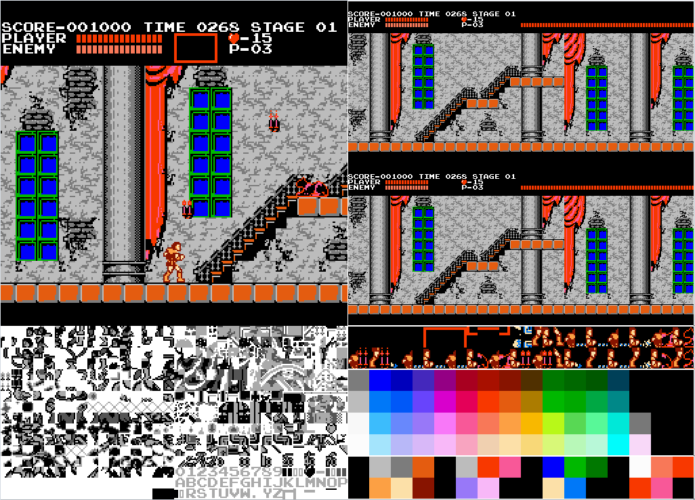

# neso-gui

[](https://opensource.org/licenses/MIT)
[](https://opensource.org/licenses/Apache-2.0)
[](https://travis-ci.org/jeffrey-xiao/neso-gui)



An SDL2 interface to [`neso-rs`](https://gitlab.com/jeffrey-xiao/neso-rs).

## Features

 - Save file and save state support.
 - Debug views for object attribute memory, nametables, pattern tables, colors, and palette.
 - Different speeds.

## Usage

```
neso-gui 0.1.0
Jeffrey Xiao <jeffrey.xiao1998@gmail.com>
A NES emulator built with Rust and sdl2.

USAGE:
    neso-gui [FLAGS] [OPTIONS] <rom-path>

FLAGS:
    -d, --debug      Enable debug views.
    -h, --help       Prints help information
    -V, --version    Prints version information

OPTIONS:
    -c, --config <config>    Path to configuration file.
    -f, --frames <frames>    Number of frames to run.

ARGS:
    <rom-path>    Path to rom.
```

## Configuration

When `neso-gui` is started, it looks for a configuration file in the following order:

1. The path specified by the `-c/--config` argument.
2. `$XDG_CONFIG_HOME/neso-gui/neso-gui.toml` if `$XDG_CONFIG_HOME` is set.
3. `$HOME/.config/neso-gui/neso-gui.toml`

### General Configuration

General configuration values are set under the `general` section in the configuration file.

| Name        | Description                                                          | Default                                                                    |
|-------------|----------------------------------------------------------------------|----------------------------------------------------------------------------|
| `data_path` | Directory file to store data files. E.G. Save files and save states. | `$XDG_DATA_HOME/neso-gui/` if defined, else `$HOME/.local/share/neso-gui/` |

### Controller Configuration

Controller configuration values are set under sections `port-1` and `port-2` in the configuration
file.

| Name     | Default Keyboard              | Default Controller |
|----------|-------------------------------|--------------------|
| `type`   | `Keyboard`                    | `Controller`       |
| `a`      | `P`                           | `a`                |
| `b`      | `O`                           | `b`                |
| `select` | [`Left Shift`, `Right Shift`] | `back`             |
| `start`  | `Return`                      | `start`            |
| `up`     | `W`                           | `dpup`             |
| `down`   | `S`                           | `dupdown`          |
| `left`   | `A`                           | `dpleft`           |
| `right`  | `D`                           | `dpright`          |

You must specify the type of the controller since there are overlap between the string
representation of keyboard keycodes and controller buttons. All values take a string or an array of
strings. In the case of an array, any of the values in the array will trigger the specified button.
For example, either `Left Shift` or `Right Shift` will trigger `select` in the default keyboard
binding. The default controller type is `Keyboard`.

### Other keybindings

Other keybinding configuration values are set under the `keybindings` section in the configuration
file.

| Name             | Default Keyboard |
|------------------|------------------|
| `type`           | `Keyboard`       |
| `mute`           | `M`              |
| `pause`          | `Space`          |
| `reset`          | `R`              |
| `exit`           | `Escape`         |
| `save_state`     | `F1`             |
| `load_state`     | `F2`             |
| `increase_speed` | `RightBracket`   |
| `decrease_speed` | `LeftBracket`    |

There are no defaults for controllers, but you can still overwrite the keyboard bindings with
controller bindings. At the moment, it is not possible to overwrite some of the keyboard bindings
with controller bindings and also modify remap keyboard bindings. For example, if you want to use
controller buttons `leftshoulder` and `rightshoulder` to trigger `save_state` and `load_state`, you
cannot also map `F1` and `F2` to `decrease_speed` and `increase_speed`; `F1` and `F2` will be
unassigned and `LeftBracket` and `RightBracket` will still be mapped to `decrease_speed` and
`increase_speed`.

### Valid Keycode and Button Strings

For valid keyboard keycode values, see [SDL_Scancode](https://wiki.libsdl.org/SDL_Scancode).

For valid controller button values, see
[SDL_GameControllerGetButtonFromString](https://github.com/spurious/SDL-mirror/blob/9f99a9c6422e45ce3940940c2d0e04a2f5389fd7/src/joystick/SDL_gamecontroller.c#L492).

### Example Default Configuration

See [neso-gui.toml](examples/neso-gui.toml) for more details.

## License

`neso-gui` is distributed under the terms of both the MIT License and the Apache License (Version
2.0).

See [LICENSE-APACHE](LICENSE-APACHE) and [LICENSE-MIT](LICENSE-MIT) for more details.
